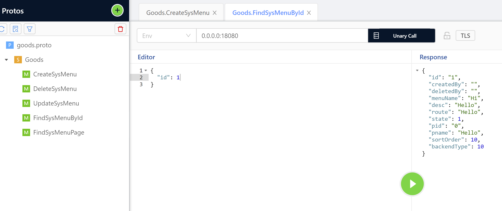

# 介绍

## 支持多配置

```
go run main.go # 会使用默认的开发配置，即 debug模式
go run main.go -env test # 会使用test的配置，即测试环境
go run main.go -env release # 会使用release的配置，即正式环境
```

## 支持多协议并存

程序可以支持：http协议，又分为内部接口、外部接口。比如

外部接口: http://127.0.0.1:8080/openapi/pc/v1/sys/menu/1

内部接口：http://127.0.0.1:8081/api/pc/v1/sys/demo

grpc接口：127.0.0.1:18080



让您的代码，一次书写，支持多端的实现。


## 支持国际化

i18n/en/error.toml

```
BadRequest = "Invalid parameter"
Unauthorized = "Unauthorized"
Forbidden = "Forbidden"
NotFound = "Record does not exist"
Conflict = "The request is conflicts"
InternalServerError = "Internal Server Error"
```

i18n/zh-CN/error.toml

```
BadRequest = "参数不合法"
Unauthorized = "授权无效"
Forbidden = "禁止访问"
NotFound = "资源不存在"
Conflict = "请求冲突"
InternalServerError = "内部错误"
```


## 支持参数自动化校验

参数校验，只需要在application/dto 中，针对具体的入参。进行绑定即可

```go
// CreateSysMenuReq 创建SysMenu 请求对象
CreateSysMenuReq struct {
		MenuName    string `validate:"required,min=1,max=4" err_info:"长度在1-4个字符" json:"menu_name"` // menu名称 【校验说明：肯定会校验，长度在1-4】
		Desc        string `validate:"omitempty,min=1,max=32" json:"desc"`                         // 描述 【校验说明：有就会校验，长度在1-32】
		Route       string `validate:"required,checkSpecialChar" json:"route"`                     // 菜单路由 【校验说明：自定义校验规则】
		State       uint   `validate:"required,oneof=1 2" json:"state"`                            // 1显示,2否 【校验说明：肯定校验，并且值只能是1或者2】
		Pid         uint64 ` json:"pid"`                                                           // 父id
		Pname       string ` json:"pname"`                                                         // 父路由名称
		SortOrder   int    ` json:"sort_order"`                                                    // 排序
		BackendType int    ` json:"backend_type"`                                                  // 1总后台，2运营后台
	}
```


## 支持全局错误统一处理

为了全局处理错误，针对mysql的错误，会写入日志中。同时关闭了 gorm not found级别的错误

增加了中间件，全局处理errro错误


## 支持全局日志管理

新增了全局日志写入，并且会自动切割，可配置日志的保存时间和个数等

manifest/config/

```
# Log.
log:
  log_file_dir: "./tmp"
  app_name: "GoDddDemo"
  max_size: 512
  max_backups: 64
  max_age: 7
```


## 支持go代码规范扫描

```
golangci-lint run --config .golangci.yml
```


## 支持go单测和报告

```
go test ./... -v -coverprofile=report/cover 2>&1 | go-junit-report > report/ut_report.xml
gocov convert report/cover | gocov-html > report/coverage.html
```


## 支持自动化代码

您只需要关心表的设计，使用cli工具，会自动化生成您想要的代码。快速实现接口开发


## 支持自动化文档

您在书写swagger3.X系列文档的时候，一定会很困扰您，书写的内容过多，并且格式也很复杂。这里会一键生成自动化的文档，您只需要非常少的书写工作。稍微改动即可。


